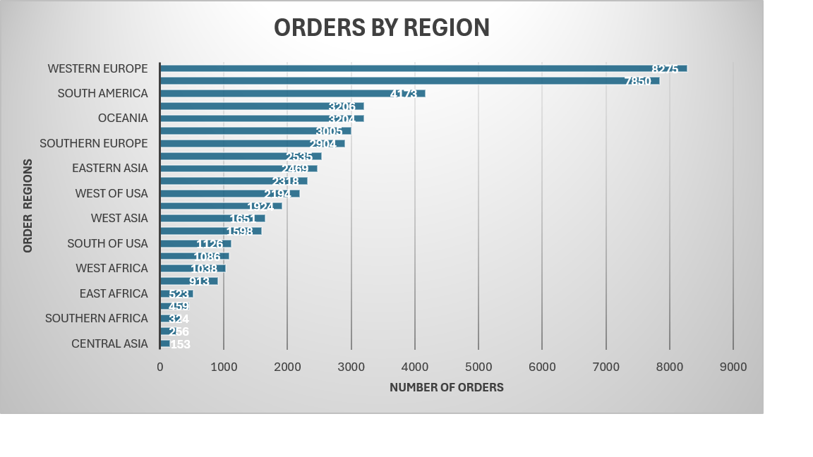
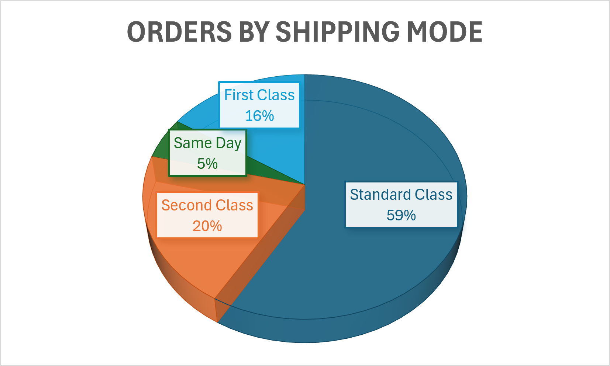
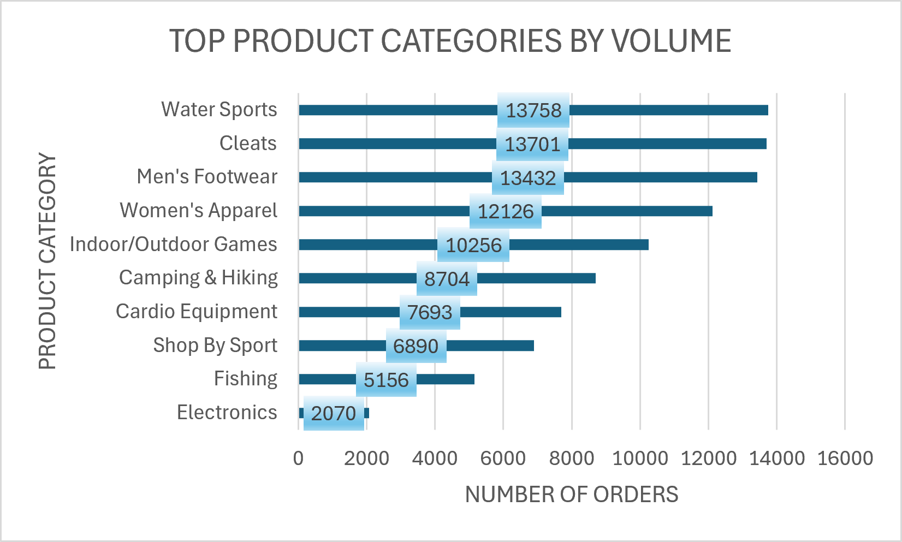
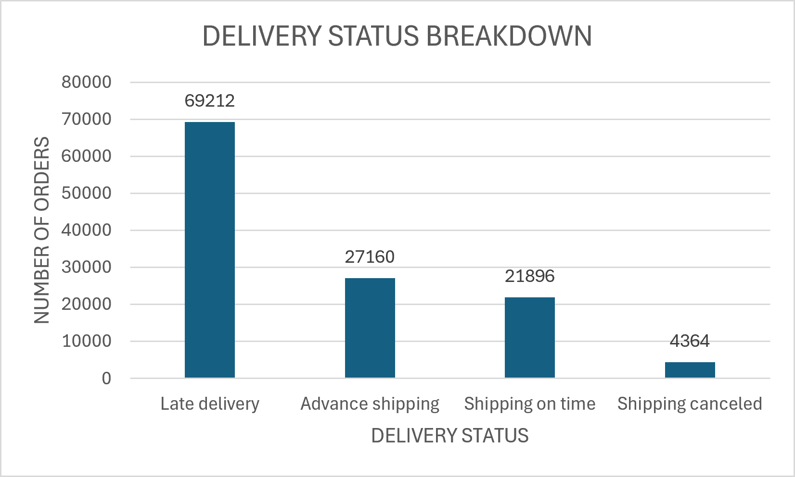
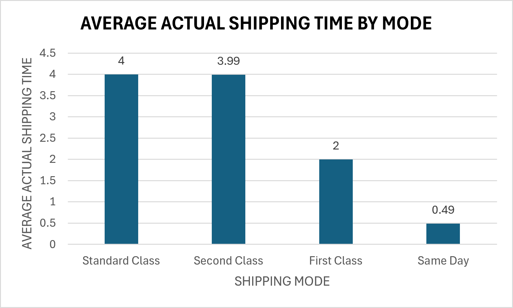
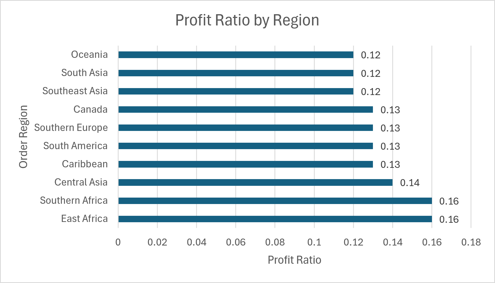
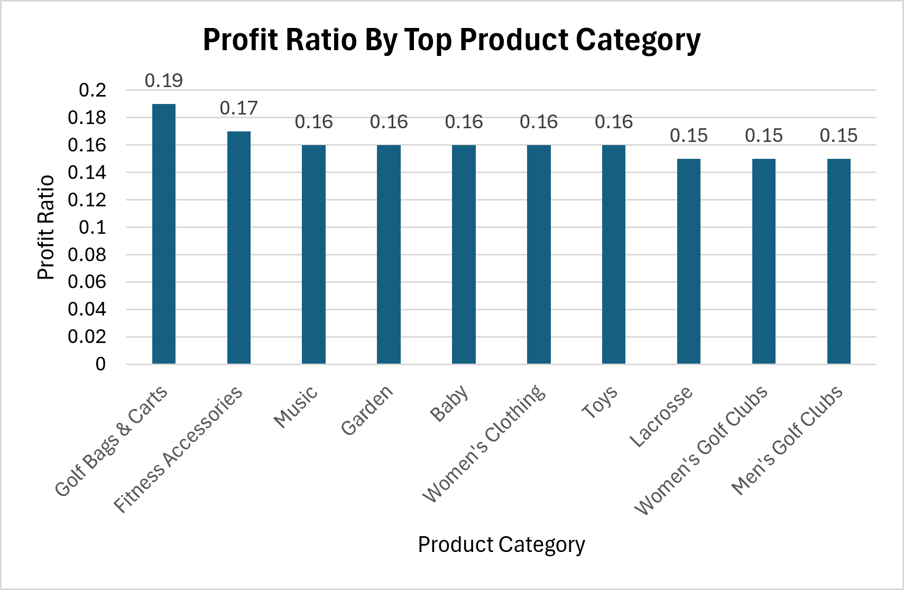
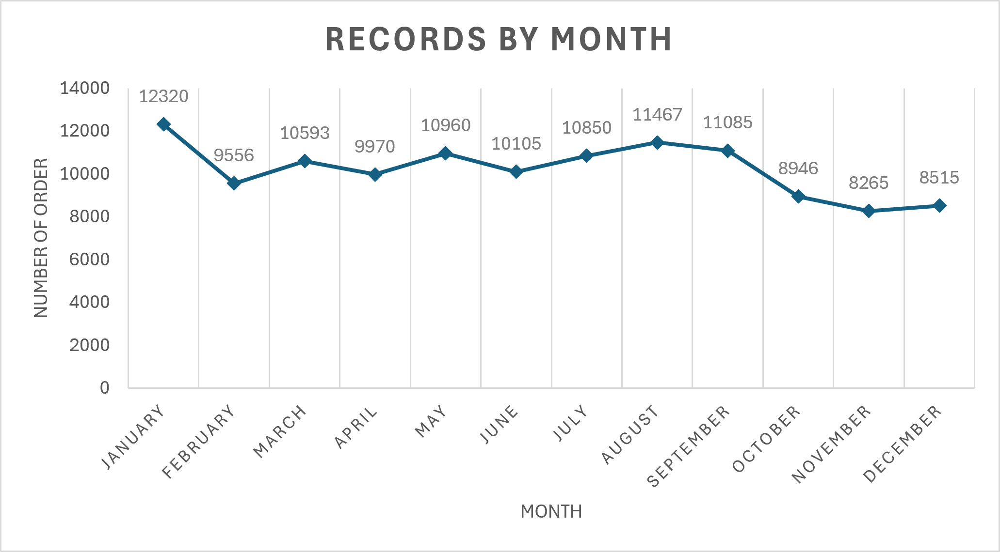

#  Supply Chain Analysis Using MySQL

SQL-based analysis of orders, delivery performance, shipping patterns, and profitability.


━━━━━━━━━━━━━━━━━━━━━━━━━━━━━━━━━━━━━━

* 53,184      Unique Orders          
* 122,632     Records
* 3.47 days   Actual Shipping
* 2.87 days   Scheduled Shipping

━━━━━━━━━━━━━━━━━━━━━━━━━━━━━━━━━━━━━━

## Business Questions

## 🔎 Business Questions

This analysis focuses on the following supply chain questions:

### 📦 Order Analysis
- Which regions generate the most orders?
- Which shipping modes are used most frequently?
- Which product categories have the highest order volume?

### 🚚 Delivery Performance
- How is delivery status distributed across the records?
- What is the average actual shipping time?
- How does actual shipping time compare with scheduled shipping time?
- Which shipping modes have higher average actual shipping times?
- Which regions have the highest late-delivery risk?

### 💰 Profitability Analysis
- Which product categories have the highest average profit ratio?
- Which regions have the highest average profit ratio?
- Which records have a profit ratio above the overall average?

### 📅 Time Analysis
- How does record volume vary by year?
- How does record volume vary by month?

## Orders by Region



## Orders by Shipping Mode



## Orders by Product Category



## Delivery Status



## Shipping Time by Mode



## Profitability

| Regional Profitability | Category Profitability |
| :---: | :---: |
|  |  |

## Monthly Trend



## Key Findings

- **Regional Concentration:** Order volume is heavily concentrated in high-demand regions, creating focal points for regional inventory stocking.
- **Fulfillment Bottlenecks:** A noticeable gap exists between scheduled shipping days and actual transit days across specific delivery channels.
- **Profit Drivers:** Specialized product categories like Golf Bags & Carts and Fitness Accessories yield the highest average profit margins, outperforming general merchandise.
- **Late Risk Factors:** Specific shipping routes account for disproportionate delivery delays, signaling a need for carrier re-evaluation.

## SQL Techniques

- `GROUP BY`
- `ORDER BY`
- `COUNT(DISTINCT)`
- `AVG`
- `SUM`
- `YEAR`
- `MONTH`
- Subqueries
- Views

## Project Structure

```text
supply-chain-sql-analysis/
│
├── assets/                  # Exported Excel visualization charts (.png)
├── queries/                 # Cleaned and organized SQL scripts
├── dataset/                 # Raw and cleaned CSV data files
└── README.md                # Project documentation
